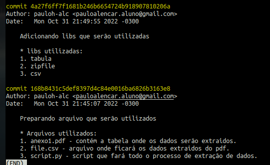
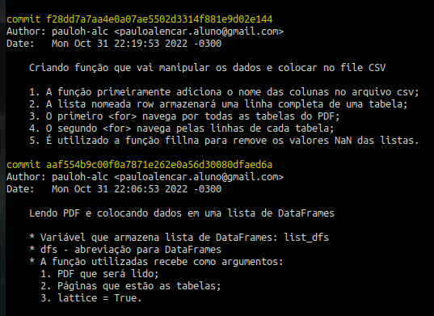
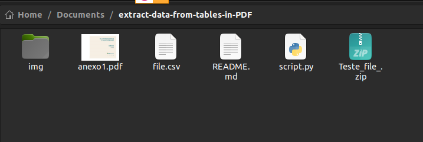
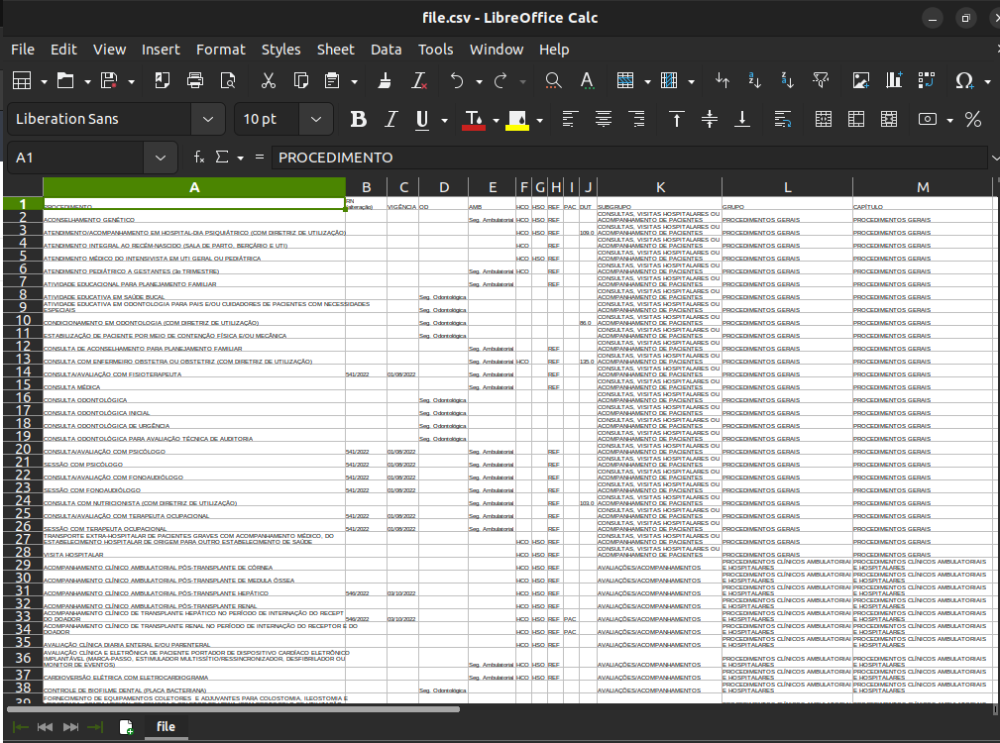

# Extraindo dados de uma tabela em PDF
- Extraindo do pdf anexo 1 os dados da tabela Rol de Procedimentos e Eventos em Saúde (todas as páginas);
- Salvar dados em uma tabela estruturada, em csv;
- Zipar o csv num arquivo "Teste_{seu_nome}.zip
- Com a legenda no rodapé substituir os dados abreviados das colunas OD e AMB para as respectivas descrições.

## Instalação

1. Clone o repositório:
```sh
git clone https://github.com/pauloh-alc/extract-data-from-table-in-PDF.git
```
2. Instale o library tabula-py
```sh
pip install tabula-py
```
## Sistema de Versão de Controle

- Git

Eu tentei fazer os commits deste projeto de uma maneira organizada. Com isso, apliquei o uso de um modelo, para uma melhor mensagem de commit.

Segue o modelo: [estilo-de-commit](https://commit.style/)

- Alguns screenshots de commits 



# Resultado

- 3374 Linhas.
- [A-M] Colunas.

